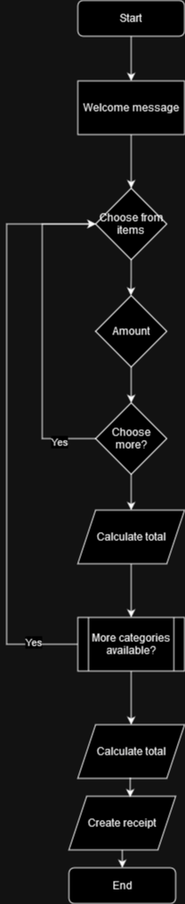

# Bakfiets project

## What it needs to do

Ask for type of bike
Ask for amount of bikes
Ask for accesories
Ask for amount of days

Calculate total;

## Bike types
- Stads fiets
- Sprint fiets
- Bak fiets
- Mountainbike fiets

## Amount of bikes
input should be std::int32.
I.E should be free input, sanitized.

## Accesories
- Helmet
- Lights
- Raincoat
- Food?
- Etc...

## Amount of days
input should be std::int32.
I.E should be free input, sanitized.

## Calculate total
... Display to prompt.